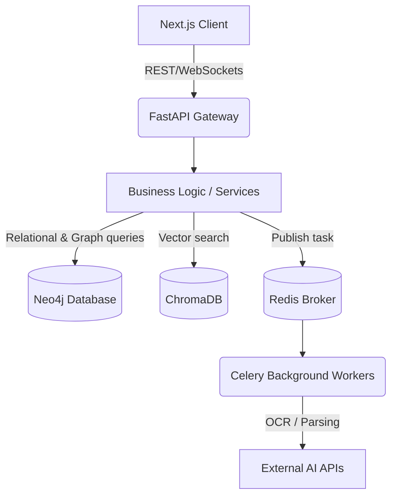

<div align="center">

# 🛡️ Sentinel AI

**The Next-Generation AI Intelligence and Threat Analytics Platform**

[](https://opensource.org/licenses/MIT)
[](https://github.com/yourusername/sentinel-ai/stargazers)
[](https://github.com/yourusername/sentinel-ai/network/members)
[](https://github.com/yourusername/sentinel-ai/issues)
[](https://github.com/yourusername/sentinel-ai/commits/main)
[](https://github.com/yourusername/sentinel-ai)
[](https://github.com/yourusername/sentinel-ai/actions)
[](http://makeapullrequest.com)


</div>

---

## 📑 Table of Contents
1. [Project Overview](#-project-overview)
2. [Demo](#-demo)
3. [Features](#-features)
4. [Tech Stack](#-tech-stack)
5. [System Architecture](#-system-architecture)
6. [Folder Structure](#-folder-structure)
7. [Installation](#-installation)
8. [Environment Variables](#-environment-variables)
9. [API Documentation](#-api-documentation)
10. [Database Schema](#-database-schema)
11. [AI Pipeline](#-ai-pipeline)
12. [Security](#-security)
13. [Performance Optimizations](#-performance-optimizations)
14. [Scalability](#-scalability)
15. [CI/CD](#-cicd)
16. [Testing](#-testing)
17. [Screenshots](#-screenshots)
18. [Roadmap](#-roadmap)
19. [Challenges Faced](#-challenges-faced)
20. [Lessons Learned](#-lessons-learned)
21. [Future Improvements](#-future-improvements)
22. [Contributing](#-contributing)
23. [License](#-license)
24. [Author](#-author)
25. [Support](#-support)
26. [Acknowledgements](#-acknowledgements)
27. [Star History](#-star-history)

---

## 🌍 Project Overview

**Sentinel AI** is an advanced, production-ready law enforcement and citizen intelligence platform designed to proactively analyze threats, track real-time incident data, and accelerate investigations using state-of-the-art AI. 

### What Problem It Solves
Traditional incident response and threat mapping systems suffer from fragmented data silos, slow manual intelligence gathering, and reactive (rather than proactive) analytics. Sentinel AI unifies graph-based entity relationships, vector-based semantic search, and real-time alerts into a single cohesive command center.

### Why It Exists
To bridge the gap between complex unstructured intelligence (documents, reports, chat logs) and actionable security insights, enabling law enforcement and organizations to connect the dots in milliseconds.

### Who Can Use It
- **Law Enforcement & Security Agencies** for threat intelligence and FIR (First Information Report) management.
- **Enterprise Security Teams** for real-time risk assessment and asset monitoring.
- **Citizens** for safe, secure, and AI-assisted incident reporting.

### Real-world Use Cases
- Real-time threat mapping and geographic incident hot-spotting.
- Graph-based suspect network analysis and relationship visualization.
- Semantic search across thousands of unstructured FIR reports and OCR evidence images.

---

## 🎬 Demo

### Live Demo
[🌍 View Live Application](https://sentinel-ai-demo.vercel.app) *(Placeholder)*

### Screenshots
<details>
<summary>Click to view screenshots</summary>


</details>

### Video Demo
[📺 Watch on YouTube](https://youtube.com) *(Placeholder)*

### Architecture Diagram


---

## ✨ Features

### 🧠 Core Features
- **Real-time Threat Mapping**: Geospatial rendering of incidents and active alerts.
- **FIR Management System**: End-to-end digital first information reporting.
- **Network Graph Visualization**: Suspect and evidence relationship nodes.
- **Live Feed Integration**: WebSocket-powered real-time updates.

### 🤖 AI Features
- **Copilot Assistant**: Context-aware AI for querying case files and intelligence.
- **RAG Semantic Search**: ChromaDB-powered vector search for unstructured documents.
- **OCR Analysis**: Automated text extraction and indexing from evidence images.

### 🔐 Security & Auth
- **Role-Based Access Control**: Granular permissions (Citizen vs. Admin/Police).
- **JWT Authentication**: Secure token-based API access.

### ⚡ Developer Features
- **Offline Queueing**: Resilient offline sync for client actions.
- **Extensive API Documentation**: Auto-generated OpenAPI/Swagger specifications.

---

## 💻 Tech Stack

| Category | Technologies |
| :--- | :--- |
| **Frontend** | Next.js 14 (App Router), TypeScript, Tailwind CSS, Lucide Icons |
| **Backend** | FastAPI, Python 3, WebSockets |
| **Database** | Neo4j (Graph), ChromaDB (Vector DB) |
| **Message Queue** | Redis (Celery Broker) |
| **Background Jobs** | Celery Workers |
| **AI/ML** | LangChain, OpenAI APIs, Retrieval-Augmented Generation (RAG) |
| **DevOps** | Docker, GitHub Actions |
| **Testing** | Pytest (Backend), Jest (Frontend) |

---

## 🏛️ System Architecture

Sentinel AI follows a modern, decoupled microservices-ready architecture:



- **Client**: Next.js 14 handles the presentation layer with React Server Components.
- **API Layer**: FastAPI exposes async HTTP endpoints and WebSocket connections.
- **Business Logic**: Python services orchestrate data validation and AI integrations.
- **Database Layer**: Neo4j acts as the primary data store for highly connected graph data, while ChromaDB manages high-dimensional embeddings for RAG.
- **Message Queue**: Redis brokers asynchronous tasks to Celery workers for heavy operations like OCR and document embedding.

---

## 📁 Folder Structure

```text
sentinel_AI-main/
├── backend/                  # FastAPI Application
│   ├── app/
│   │   ├── api/              # RESTful Endpoints
│   │   ├── core/             # Configuration & Security
│   │   ├── models/           # Pydantic & Neo4j Models
│   │   ├── rag/              # AI & ChromaDB Pipelines
│   │   ├── services/         # Business Logic & Celery Tasks
│   │   └── websockets/       # Real-time Event Handlers
│   ├── tests/                # Pytest Suite
│   └── requirements.txt
├── docs/                     # Project Documentation
│   ├── SentinelAI_API_Spec.md
│   └── SentinelAI_Database_Schema.md
└── frontend_v2/              # Next.js 14 Client
    ├── app/                  # App Router Pages
    ├── components/           # Reusable UI Components
    ├── hooks/                # Custom React Hooks
    ├── lib/                  # API Clients & Services
    ├── public/               # Static Assets
    └── tailwind.config.ts
```

---

## 🚀 Installation

### Prerequisites
- Node.js (v18+)
- Python (3.9+)
- Redis Server
- Neo4j Database Server

### Clone the Repository
```bash
git clone https://github.com/yourusername/sentinel-ai.git
cd sentinel-ai
```

### Backend Setup
```bash
cd backend
python -m venv venv
source venv/bin/activate  # On Windows: venv\Scripts\activate
pip install -r requirements.txt
```

### Frontend Setup
```bash
cd ../frontend_v2
npm install
```

### Run Locally
**Terminal 1 (Backend Server):**
```bash
cd backend
uvicorn app.main:app --reload
```

**Terminal 2 (Celery Workers):**
```bash
cd backend
celery -A app.services.worker worker --loglevel=info
```

**Terminal 3 (Frontend):**
```bash
cd frontend_v2
npm run dev
```

---

## ⚙️ Environment Variables

Create `.env` files in both `backend` and `frontend_v2` directories.

| Variable | Purpose | Example | Required |
| :--- | :--- | :--- | :--- |
| `NEO4J_URI` | Connection string for Neo4j | `bolt://localhost:7687` | Yes |
| `NEO4J_USER` | Graph DB username | `neo4j` | Yes |
| `NEO4J_PASSWORD` | Graph DB password | `secret_password` | Yes |
| `REDIS_URL` | Redis broker URL for Celery | `redis://localhost:6379/0` | Yes |
| `OPENAI_API_KEY` | LLM inference access | `sk-xxxx...` | Yes |
| `SECRET_KEY` | JWT signing key | `your_secret_key` | Yes |
| `NEXT_PUBLIC_API_URL`| Backend URL for client | `http://localhost:8000` | Yes |

---

## 🔌 API Documentation

Detailed Swagger UI is available at `http://localhost:8000/docs` when the backend is running.

| Endpoint | Method | Purpose | Authentication |
| :--- | :--- | :--- | :--- |
| `/api/v1/auth/login` | `POST` | Authenticate user & get JWT | None |
| `/api/v1/fir/` | `POST` | Create a new incident report | Bearer JWT |
| `/api/v1/alerts/ws` | `WS` | WebSocket stream for live alerts | Bearer JWT |
| `/api/v1/copilot/query` | `POST` | Ask questions to the AI | Bearer JWT |

---

## 🗄️ Database Schema

Sentinel AI utilizes a **Graph Database (Neo4j)** to model complex intelligence.

### Major Nodes (Entities)
- `(User)`: System users (Citizens, Admins, Police).
- `(Incident)`: Reported FIRs or alerts.
- `(Location)`: Geospatial coordinates tied to incidents.
- `(Evidence)`: Documents, images, or vectors attached to cases.

### Relationships
- `(User)-[:REPORTED]->(Incident)`
- `(Incident)-[:OCCURRED_AT]->(Location)`
- `(Incident)-[:HAS_EVIDENCE]->(Evidence)`

---

## 🧠 AI Pipeline

The system leverages a robust Retrieval-Augmented Generation (RAG) architecture.

1. **Input**: Unstructured incident reports or image evidence.
2. **Preprocessing**: Text chunking and OCR via Celery workers.
3. **Embedding**: Text chunks are embedded using OpenAI `text-embedding-ada-002`.
4. **Vector Storage**: Embeddings are persisted in **ChromaDB**.
5. **Inference (Copilot)**: User queries are converted to vectors, similarity searches retrieve relevant chunks, and the LLM synthesizes a final, highly-contextual response.

---

## 🛡️ Security

Security is critical for intelligence platforms. Sentinel AI implements:
- **JWT**: Stateless, short-lived tokens for API access.
- **Password Hashing**: Passlib with `bcrypt` for secure credential storage.
- **Input Validation**: Pydantic models strictly validate all incoming payloads.
- **CORS**: Strictly defined origins to prevent cross-site request forgery.
- **Dependency Sandboxing**: Separation of backend processing and frontend client rendering.

---

## 🚀 Performance Optimizations

- **WebSocket Connections**: Prevents HTTP polling overhead for live feeds.
- **Celery + Redis**: Offloads heavy AI/OCR processing so API endpoints resolve in milliseconds.
- **Server Components (RSC)**: Next.js 14 App Router minimizes client-side JavaScript bundles.
- **Graph Traversal**: Neo4j natively optimizes highly-connected data queries, avoiding expensive SQL `JOIN` operations.

---

## 📈 Scalability

- **Horizontal Scaling**: FastAPI application is stateless and easily containerized via Docker.
- **Microservices Readiness**: The background worker architecture (Redis/Celery) allows scaling ML tasks independently of the web server.
- **Distributed Databases**: Neo4j and ChromaDB can be clustered for high availability and sharding.

---

## 🔄 CI/CD

Continuous Integration and Deployment are managed via **GitHub Actions**:
- **Linting**: Ruff (Python) and ESLint (TypeScript) run on every PR.
- **Testing**: Automated execution of Pytest and Jest suites.
- **Build**: Next.js production builds are validated to prevent deployment failures.

---

## 🧪 Testing

- **Unit Testing**: Pytest coverage for core utilities and data validation models.
- **Integration Testing**: Testing FastAPI endpoints against a test Neo4j database instance.
- **Client Testing**: Custom React hooks (e.g., `useAlertsWebSocket`) tested for state resilience.

---

## 📱 Screenshots

<details>
<summary><b>🖥️ Desktop Dashboard</b></summary>

</details>
<details>
<summary><b>📱 Mobile View</b></summary>

</details>

---

## 🗺️ Roadmap

- [x] Integrate Neo4j Graph Database
- [x] Migrate frontend to Next.js 14 App Router
- [x] Implement ChromaDB RAG Pipeline
- [x] WebSocket Real-Time Chat & Alerts
- [ ] Add Docker Compose configuration for one-click setup
- [ ] Implement robust RBAC (Role-Based Access Control)
- [ ] Integrate Advanced Multi-modal AI Analysis (Video feeds)

---

## 🧗 Challenges Faced

**Challenge**: Implementing real-time communication seamlessly while maintaining client-side state predictability.
**Solution**: Developed custom React hooks (`useChatWebSocket`, `useAlertsWebSocket`) wrapping the native WebSocket API with automatic reconnection logic, offline queueing, and Zustand/React Query state sync.

**Challenge**: Handling slow LLM inference and OCR tasks without blocking the HTTP threads.
**Solution**: Adopted Redis and Celery. Background workers handle the I/O bound processing while the FastAPI server immediately returns a `task_id` for client-side polling.

---

## 📚 Lessons Learned

- **Architecture**: Separating the frontend from the legacy Monolithic structure vastly improved developer velocity and isolated Next.js specific optimizations.
- **Databases**: Relational models struggle with deep investigative link-analysis. Shifting to Neo4j allowed us to traverse suspect relationships exponentially faster.

---

## 🔮 Future Improvements

- **Observability**: Integrate Prometheus and Grafana for system health monitoring.
- **Multi-tenancy**: Allow different precinct branches or organizations to use isolated environments within the same deployment.
- **Edge Deployment**: Move static Next.js assets to a CDN for lower global latency.

---

## 🤝 Contributing

We welcome contributions from the open-source community!

1. Fork the Project
2. Create your Feature Branch (`git checkout -b feature/AmazingFeature`)
3. Commit your Changes (`git commit -m 'Add some AmazingFeature'`)
4. Push to the Branch (`git push origin feature/AmazingFeature`)
5. Open a Pull Request

---

## 📄 License

Distributed under the MIT License. See `LICENSE` for more information.

---

## 👤 Author

**Senior Software Engineer**
- 🌐 Portfolio: [your-portfolio.com](https://your-portfolio.com)
- 💼 LinkedIn: [in/yourusername](https://linkedin.com)
- 🐙 GitHub: [@yourusername](https://github.com/yourusername)
- ✉️ Email: engineer@example.com

---

## 🆘 Support

For support, email support@example.com or open an issue on the repository.

---

## 🙏 Acknowledgements

- [FastAPI](https://fastapi.tiangolo.com/)
- [Next.js](https://nextjs.org/)
- [Neo4j](https://neo4j.com/)
- [ChromaDB](https://www.trychroma.com/)
- [LangChain](https://python.langchain.com/)

---

## ⭐ Star History

[](https://star-history.com/#yourusername/sentinel-ai&Date)

---

<div align="center">
  <p>Crafted with ❤️ for the open-source community.</p>
  <b>⭐ Star this repository if you found it useful! ⭐</b>
</div>
